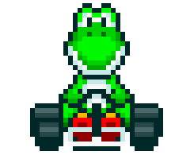

# Mario Kart Racing Simulator

> Projeto completo do desafio do Felipão da DIO, do curso de Node.js, adaptado e implementado por mim.

## Objetivo

<table>
  <tr>
    <td>
      
    </td>
    <td>
      <b>Objetivo:</b>
      
Simular uma corrida de Mario Kart com dois personagens em um circuito de 5 rodadas, usando dados e atributos para retas, curvas e confrontos.

    </td>
  </tr>
</table>

## Personagens

<table style="border-collapse: collapse; width: 800px; margin: 0 auto;">
  <tr>
    <td style="border: 1px solid black; text-align: center;">
Mario
</td>
    <td style="border: 1px solid black; text-align: center;">
Velocidade: 4

Manobrabilidade: 3

Poder: 3
</td>
    <td style="border: 1px solid black; text-align: center;">
Peach
</td>
    <td style="border: 1px solid black; text-align: center;">
Velocidade: 3

Manobrabilidade: 4

Poder: 2
</td>
    <td style="border: 1px solid black; text-align: center;">
Yoshi
</td>
    <td style="border: 1px solid black; text-align: center;">
Velocidade: 2

Manobrabilidade: 4

Poder: 3
</td>
  </tr>
  <tr>
    <td style="border: 1px solid black; text-align: center;">
Bowser
</td>
    <td style="border: 1px solid black; text-align: center;">
Velocidade: 5

Manobrabilidade: 2

Poder: 5
</td>
    <td style="border: 1px solid black; text-align: center;">
Luigi
</td>
    <td style="border: 1px solid black; text-align: center;">
Velocidade: 3

Manobrabilidade: 4

Poder: 4
</td>
    <td style="border: 1px solid black; text-align: center;">
Donkey Kong
</td>
    <td style="border: 1px solid black; text-align: center;">
Velocidade: 2

Manobrabilidade: 2

Poder: 5
</td>
  </tr>
</table>

## Como funciona

O jogo escolhe um personagem para o jogador e um oponente aleatório. São 5 rodadas, e em cada rodada o tipo de pista é sorteado entre:

- Reta: usa velocidade
- Curva: usa manobrabilidade
- Confronto: usa poder

Para cada rodada, o simulador joga um dado de 6 lados e soma ao atributo correspondente. Nas retas e curvas, quem tem maior resultado ganha 1 ponto. Nos confrontos, o perdedor perde 1 ponto, mas a pontuação nunca fica negativa.

## Resultado

Vence quem acumula mais pontos ao final das 5 rodadas. Se empatar, o jogo termina em empate.

## Tecnologias usadas

- Node.js
- JavaScript
- readline-sync

## Conceitos aprendidos

- lógica de jogo e fluxo de rodadas
- uso de arrays e objetos para armazenar personagens
- estruturas condicionais `switch` e `if`
- tempo de execução com `setTimeout` e promessas
- interação com o usuário via terminal
- jogo inteiro em inglês
